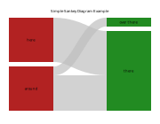

# 4sg
**S**mall and **S**imple **S**VG **S**ankey **G**enerator (using XSLT)

4sg is an XSLT script that converts data stored in an XML file into a [Sankey diagram](https://en.wikipedia.org/wiki/Sankey_diagram) generated as SVG file.  

SVG (Scalable Vector Graphics) is a W3C standard for vector graphics supported by all modern browsers. It can be edited with graphic design programs like Inkscape. An SVG file doesn't contain a pixel image, but the coordinates and details of lines and curves as text in XML format. The code can also be edited with any editor. Besides editing, the greatest advantages are scalability without loss of quality and the fact that it is a well documented and supported open standard.  

Because both the data source and the target are each an XML file, XSLT is ideal as a tool for transformation. This language was designed for transforming XML files and is written in XML format itself. XSLT is a W3C standard, too.  

To run the XSLT script a processor that masters XSLT 3.0 is required. There are two of them, the script has been tested with both:  
- Saxon HE ([www.saxonica.com](https://www.saxonica.com)) home edition for Java hosted free here at [Github](https://github.com/Saxonica/Saxon-HE), the commercial PE or EE version isn't required but there is an .NET Version in EE enterprise edition, and  
- XMLSpy ([www.altova.com/xmlspy-xml-editor](https://www.altova.com/xmlspy-xml-editor)), commercial.  

Project files:
- 4sg.xsl: Script
- SimpleExample.xml: Source data  
- SimpleExample.svg: Generated Sankey Diagram  

As the Saxon processor is also available running in browsers on javascript, there is now a third option available.

Project files:
- 4sg.html: Complete solution in one file
- 4sg.sef.json: Compiled version of the 4sg.xsl stylesheet in json format for use with SaxonJS 3, already embedded in the html file, no need to download
- SaxonJS3.rt.js: XSLT 3.0 javascript processor provided by Saxonica Ltd, not provided as a separate file in this repository but embedded in the html file

Using 4sg.html you just need this file and a XML data file that matches 4sg specifications. No need to install a XSLT 3.0 processor as that is already embedded in the html file.

Some real life examples are available in the examples directory. If you use 4sg the contribution of examples is very appreciated.

See also [GitHub Pages](https://andreasheese.github.io/4sg/) and try live 4sg.html browser version. You have to download a XML data file from the examples folder first to be able to select the file.
