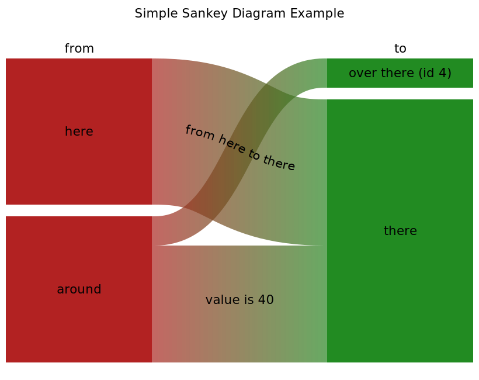

# 4sg
**S**mall and **S**imple **S**VG **S**ankey **G**enerator (using XSLT)

4sg is an XSLT script that converts data stored in an XML file into a [Sankey diagram](https://en.wikipedia.org/wiki/Sankey_diagram) generated as SVG file.  

SVG (Scalable Vector Graphics) is a W3C standard for vector graphics supported by all modern browsers. It can be edited with graphic design programs like Inkscape. An SVG file doesn't contain a pixel image, but the coordinates and details of lines and curves as text in XML format. The code can also be edited with any editor. Besides editing, the greatest advantages are scalability without loss of quality and the fact that it is a well documented and supported open standard.  

Because both the data source and the target are each an XML file, XSLT is ideal as a tool for transformation. This language was designed for transforming XML files and is written in XML format itself. XSLT is a W3C standard, too.  

To run the XSLT script a processor that masters XSLT 3.0 is required. There are two of them, the script has been tested with both:  
- Saxon HE ([www.saxonica.com](https://www.saxonica.com), for Java or .NET, hosted free at Sourceforge, the commercial PE or EE version isn't required) and  
- XMLSpy ([www.altova.com/xmlspy-xml-editor](https://www.altova.com/xmlspy-xml-editor), commercial).  

Project files:
- 4sg.xsl: Script
- SimpleExample.xml: Source data  
- SimpleExample.svg: Generated Sankey Diagram  

Some real life examples are available in the examples directory, each with a raw XML data file and the generated SVG file. If you use 4sg.xsl the contribution of examples is very appreciated.

See also [GitHub Pages](https://andreasheese.github.io/4sg/).
